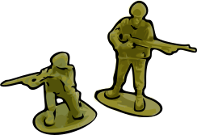

# Simple Plastic Wargame

A simple and fast set of rules for tabletop wargaming

## Why make another set of rules?

I wanted to introduce my kids (5-9 years old) to tabletop wargaming. When I
tried I immediately bumped against an obstacle: they could not play more than
two turns - they got bored.

This ruleset is designed to keep play fast and fluid (and hopefully fun).

## Turns

Each turn is divided into two phases: moving and attacking.

## Moving

Each unit may move up to the one span per turn (the distance between thumb and
little finger). Adults and older teens must use a short span (distance between
index finger and little finger) because it would be unfair otherwise.

OK. If you want to be pedantic, the move distance is roughly 4 inches
(or exactly 4 inches if you want to insist).

Units are moved by squad (if they're in a squad - which most should be).
First move the frontmost unit by the desired distance. Then move the rest of
the squad behind him. You only need to correctly measure the movement of the
first unit. The rest may just follow. It doesn't matter if some units move a
lot more than one span (we just assume that that run to catch up) only the
distance of the first move matters.

## Attacking

There are two types of attacks: ranged attack and hand-to-hand.

Ranged attacks happens whenever squads are attacking other squads or units that
are more than two finger widths away (roughly 1/2 an inch). But whenever squads
are within one span of their target before the movement phase they may elect to
engage in hand-to-hand by moving towards the target and placing as many of the
units as possible into base-to-base contact with the target squad or unit.

### Ranged Attack

Each unit may roll one D6 to attack. Generally, a roll of 4 or more kills one
target. Let's call this the to-kill roll (or to-kill number).

Depending on conditions on the battlefield, the to-kill number may be modified:

| Conditions                                   | to-kill Modifier |
|----------------------------------------------|-----------------:|
| Target downhill from you                     |        -1        |
| Attacker is a sniper or uses a heavy weapon  |        -1        |
| Attacker did not move                        |        -1        |
| Target uphill from you                       |        +1        |
| Target behind cover                          |        +1        |
| Target is a sniper or carries a heavy weapon |        +1        |
| Target is in a vehicle                       |        +1        |

A roll of 1 never kills regardless of the to-kill modifier. If the to-kill number
is more than 6 then the target is too well protected to be attacked and must
be ignored.

Attacks are resolved closest first. That is, if the target is a squad, the
frontmost unit gets killed first.

### Hand-to-hand Combat

Like ranged attack, each unit may roll one D6 to attack. Each opposing unit then
also rolls one D6 to defend. If the attacking roll is equal to or higher than the
defending roll then the target is killed. This means that a roll of 6 always kills
and a roll of 1 kills if the defending roll is 1.

If there are more attackers than defenders then the second attacker may also make
a roll on the same target unit. The defender only rolls once for both attacks.

## Copyright

(c) 2016 Adly Abdullah <slebetman@gmail.com>

This document, weather in electronic or printed form, is distributed under the
GNU All-Permissive License. The full text of the license is as follows:

Copying and distribution of this file, with or without modification, are
permitted in any medium without royalty provided the copyright notice and this
notice are preserved.  This file is offered as-is, without any warranty.
