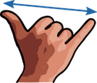

# Simple Plastic Wargame

*A simple and fast set of rules for tabletop wargaming*

## Why make another set of rules?

I wanted to introduce my kids (5-9 years old) to tabletop wargaming. When I
tried I immediately bumped against an obstacle: they could not play more than
two turns - they got bored.

This ruleset is designed to keep play fast and fluid (and hopefully fun).

## Turns

Each turn is divided into two phases: moving and attacking.

## Moving

Each unit may move up to the one span per turn (the distance between thumb and
little finger). Adults and older teens must use a short span (distance between
index finger and little finger) because it would be unfair otherwise.

|             |  |
|------------------------------------|-----------------------------------|
| *Maximum distance units can move.* | *Adults must use the short span.* |

OK. If you want to be pedantic, the move distance is roughly 4 inches
(or exactly 4 inches if you want to insist).

Units are moved by squad (if they're in a squad - which most should be).
First move the frontmost unit by the desired distance. Then move the rest of
the squad behind him. You only need to correctly measure the movement of the
first unit. The rest may just follow. It doesn't matter if some units move a
lot more than one span (we just assume that that run to catch up) only the
distance of the first move matters.

### Squad Cohesion

When moving a squad, players must keep units within one finger distance from
each other (roughly 1/2 inch). Any gaps in the squad caused by units in the
squad dying must be closed.

If a squad merely closes gaps but stays roughly at the same location then the
squad is considered to have not moved.

## Attacking

Units may attack enemy squads/units in the attacking phase. The target must be
visible in the attacker's line of sight. Targets completely blocked by terrain,
buildings or other types of cover may not be attacked. If even a small part of
the target can be seen by the attacker than it may be attacked.

Each unit may roll one D6 to attack. Generally, a roll of 4 or more kills one
target. Let's call this the to-kill roll (or to-kill number).

### Modifiers

Depending on conditions on the battlefield, the to-kill number may be modified:

| Conditions                                   | to-kill Modifier |
|----------------------------------------------|-----------------:|
| Target is downhill from attacker             |        -1        |
| Attacker is a special unit                   |        -1        |
| Attacker did not move                        |        -1        |
| Target is uphill from attacker               |        +1        |
| Target behind cover                          |        +1        |
| Target is a special unit                     |        +1        |
| Target is in a vehicle                       |        +1        |

A roll of 1 never kill regardless of the to-kill modifier. If the to-kill number
is more than 6 then the target is too well protected to be attacked and must
be ignored.

Attacks are resolved closest first. That is, if the target is a squad, the
frontmost unit gets killed first.

### Cover

Anything that blocks the view of the target from the attacker is cover. Solid
covers like walls, buildings and terrain may completely block the target. If
the target is completely blocked then it may not be attacked. Semi-solid cover
like bushes and fences always counts as partially covering the target even if
the target is completely behind cover.

### Special Units

There are always specialists in every army. They either carry special weapons
or have special skills that are useful in battle. More importantly, they add
variety to the army and provide more fun! Players may employ one specialist for
every squad fielded.

 - **Heavy Weapons Unit**
 
    
 
   This is a soldier carrying a heavy weapon such as a heavy machine gun or
   bazooka or mortar etc. A heavy weapons unit may be part of a squad or
   may operate individually.
   
   Heavy weapons units **roll 4 D6 when attacking**.
   
 - **Sniper**

   
 
   Snipers operate individually and are never part of a squad. Unlike other
   units, snipers cannot attack if they have moved. Which means, to attack
   a sniper cannot move.
   
   Snipers may attack twice per turn. They do not need to use both attacks
   on the same target so **a sniper may attack two different targets per turn**.
   
   Since snipers don't move when attacking and is a special unit they get
   both "did not move" and "special unit" modifiers when attacking.
   
   Use prone/crawling figures as snipers.

## Copyright

(c) 2016 Adly Abdullah <slebetman@gmail.com>

This document, weather in electronic or printed form, is distributed under the
GNU All-Permissive License. The full text of the license is as follows:

Copying and distribution of this file, with or without modification, are
permitted in any medium without royalty provided the copyright notice and this
notice are preserved.  This file is offered as-is, without any warranty.
